# Documentación de la interfaz — babytool

## 1. Justificación del diseño

### 1.1 Importancia del diseño centrado en el usuario

El diseño centrado en el usuario (DCU) sitúa a la persona que va a usar la aplicación en el centro de todas las decisiones de diseño. En una app de compra de ropa infantil, esto es especialmente crítico porque el usuario suele ir con prisa, compra desde el móvil con una sola mano y, en muchos casos, no tiene al niño delante para probarle la talla. Un mal diseño provoca carritos abandonados, devoluciones costosas y desconfianza en la marca. Aplicar DCU permite reducir la fricción en el flujo de compra, facilitar la elección de talla y transmitir confianza a un público que no es nativo digital. Siguiendo a Norman (2013), un buen diseño debe hacer que las cosas funcionen sin que el usuario tenga que pensar cómo funcionan.

### 1.2 Objetivos y metas del proyecto

Los objetivos del proyecto son medibles y verificables:

1. **Completar una compra en menos de 2 minutos** desde la pantalla de inicio, incluyendo elección de talla y pago.
2. **Reducir la duda de talla:** al menos el 70 % de los usuarios de prueba deben encontrar la guía de tallas sin ayuda en menos de 15 segundos.
3. **Facilitar el uso a una mano:** todas las acciones críticas (buscar, añadir al carrito, pagar) deben estar alcanzables con el pulgar en una pantalla de 360×800 dp.
4. **Cumplir accesibilidad WCAG AA:** todo el texto debe superar un contraste mínimo de 4,5:1 y todas las áreas táctiles deben medir al menos 48×48 dp.

### 1.3 Beneficios esperados

**Para el usuario:** menos tiempo de compra, menos errores de talla, sensación de control con el carrito (con opción de deshacer) y una experiencia accesible para abuelos o personas con poca destreza digital.

**Para el negocio:** mayor tasa de conversión, menos carritos abandonados, menos devoluciones por talla incorrecta, mayor fidelización gracias a la sección de favoritos y datos de comportamiento útiles para futuras campañas.

## 2. Investigación y análisis de usuarios

### 2.1 Datos demográficos y segmentación

El público objetivo son principalmente **madres y padres de 30 a 45 años** que compran ropa para sus hijos de 0 a 14 años, y **abuelos de 55 a 70 años** que compran regalos puntuales. También hay un segmento minoritario de **personas que compran para sobrinos o amigos** (regalos). El dispositivo dominante es el móvil Android, y el contexto de uso habitual es "de pie, con una mano, en ratos muertos" (transporte, sala de espera, sofá).

Se segmenta en:

- **Compradores recurrentes:** madres/padres que compran cada temporada. Valoran rapidez y filtros por talla.
- **Compradores ocasionales:** abuelos o regaladores. Valoran guía de tallas y descripciones claras.
- **Exploradores:** usuarios que miran novedades sin intención inmediata de compra. Valoran favoritos y categorías por edad.

### 2.2 Personas

#### Persona 1: Marta, 38 años, madre de dos hijos (4 y 8 años)

- **Contexto:** Trabaja a jornada completa, compra ropa infantil desde el móvil en el autobús o mientras espera a los niños en extraescolares. Usa una mano.
- **Objetivos:** renovar el armario de los niños sin perder tiempo, encontrar la talla correcta a la primera, aprovechar ofertas.
- **Frustraciones:** webs lentas, no poder filtrar por edad y talla a la vez, no saber si la talla 4 años le quedará al pequeño, y tener que rehacer el carrito si se equivoca.
- **Frase:** "No tengo tiempo para buscar. Si en 30 segundos no encuentro lo que quiero, me voy."

#### Persona 2: Antonio, 67 años, abuelo que compra un regalo a su nieta

- **Contexto:** Compra desde el móvil en casa, con gafas, letra grande. No está acostumbrado a apps de moda. Quiere acertar con la talla porque no vive cerca de la nieta.
- **Objetivos:** comprar un regalo bonito sin equivocarse de talla, pagar de forma segura y que llegue a tiempo.
- **Frustraciones:** letra pequeña, iconos sin texto, formularios largos, no saber qué talla equivale a los años de la niña, y miedo a pagar mal.
- **Frase:** "Solo quiero un pijama talla 4 años. No entiendo por qué es tan complicado."

### 2.3 Análisis de la competencia

| App | Qué hace bien | Qué hace mal | Qué me llevo |
|---|---|---|---|
| **Zara** | Diseño limpio, navegación rápida, imágenes grandes. | No tiene filtro claro por edad/talla infantil; guía de tallas poco accesible en el flujo de compra. | Grid de productos limpio y tipografía clara. |
| **H&M** | Filtros por talla y color muy completos; buena guía de tallas. | Flujo de checkout con demasiados pasos; app pesada. | La guía de tallas accesible como bottom sheet desde el detalle. |
| **Prénatal** | Categorización por edad muy visible (Bebé, Niña, Niño); enfoque claro en padres. | Estética anticuada; iconografía poco clara; poca personalización. | Categorización por edad en la pantalla de inicio. |
| **Vinted** | Excelente sistema de favoritos y notificaciones; filtros potentes. | No es una tienda oficial; no aplica a ropa nueva. | Sección de favoritos como tercer destino de navegación. |

### 2.4 Insights y hallazgos clave

1. **Los usuarios dudan con las tallas.** La equivalencia entre edad y talla varía por marca.
   → **Decisión de diseño:** botón "Guía de tallas" visible en el detalle, que abre un *bottom sheet* con tabla de equivalencias y consejos.

2. **El pulgar manda.** La mayoría usa el móvil con una sola mano y el pulgar no llega a la esquina superior.
   → **Decisión de diseño:** colocar acciones críticas (añadir al carrito, pagar) en la zona inferior de la pantalla, dentro del alcance del pulgar (patrón *thumb zone*).

3. **Equivocarse da miedo.** Eliminar un producto del carrito sin querer genera frustración.
   → **Decisión de diseño:** al eliminar, mostrar un *snackbar* con acción "Deshacer" durante 5 segundos.

4. **El error asusta.** Un formulario de pago con campos mal validados genera abandono.
   → **Decisión de diseño:** usar *text fields* M3 con estado de error claro, mensaje de ayuda y validación en el momento (no solo al enviar).

5. **Los abuelos necesitan letra grande y texto en iconos.**
   → **Decisión de diseño:** tipografía base 16 sp, etiquetas visibles bajo los iconos de la *navigation bar* y áreas táctiles de 48×48 dp como mínimo.

   > **Conclusión de la investigación:** los cinco insights anteriores guían todas las decisiones de diseño que se documentan a partir de la sección 3. Cualquier pantalla del prototipo debe poder justificarse desde al menos uno de ellos.

## 3. Diseño de la interfaz
### 3.1 Mapa de navegación
### 3.2 Wireframes
Wireframes de baja fidelidad en escala de grises, en frames Android Compact de 360×800 dp.

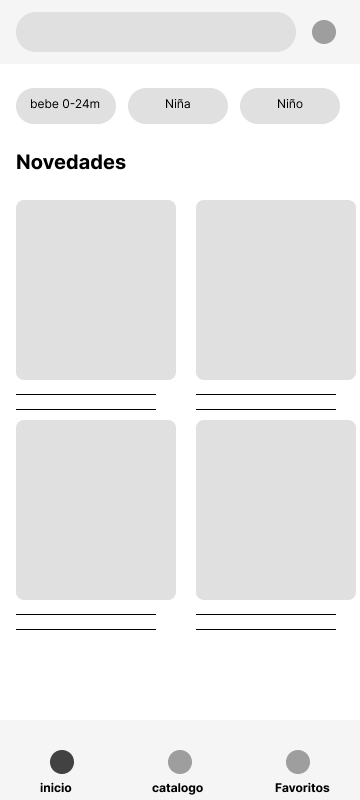
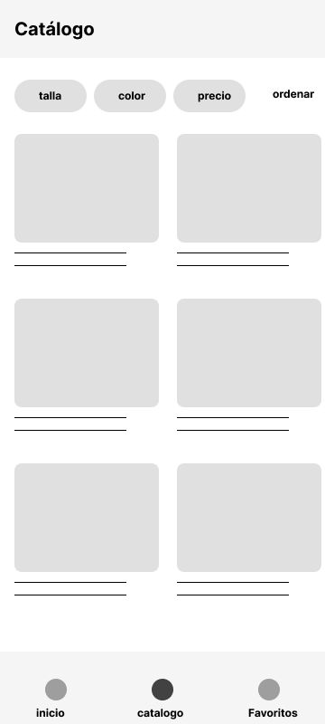
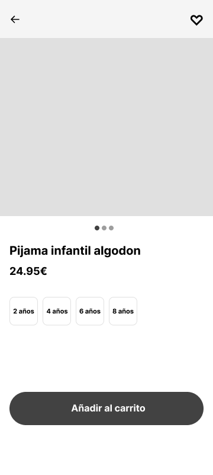
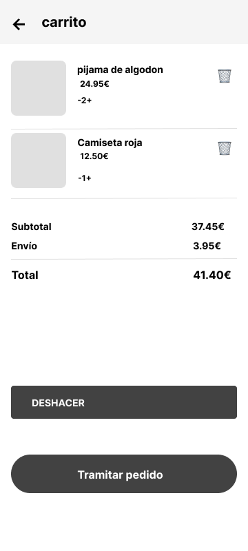
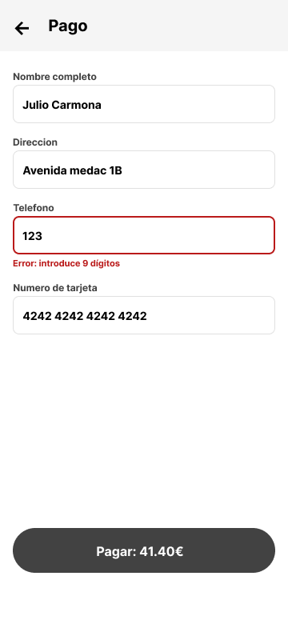

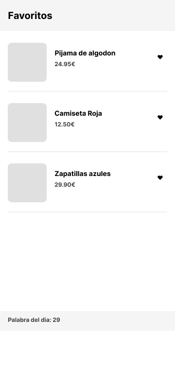
### 3.3 Guía de estilo Material Design 3
**Color semilla:** `#26A69A` (turquesa)

**Esquema claro:**

| Pareja | Ratio | Cumple AA |
|---|---|---|
| primary / onPrimary | 6.4:1 | ✅ |
| primaryContainer / onPrimaryContainer | 6.8:1 | ✅ |
| secondary / onSecondary | 6.6:1 | ✅ |
| tertiary / onTertiary | 6.4:1 | ✅ |
| surface / onSurface | 15.9:1 | ✅ |
| error / onError | 5.7:1 | ✅ |

**Esquema oscuro:**

| Pareja | Ratio | Cumple AA |
|---|---|---|
| primary / onPrimary | 7.5:1 | ✅ |
| primaryContainer / onPrimaryContainer | 7.2:1 | ✅ |
| secondary / onSecondary | 8.4:1 | ✅ |
| tertiary / onTertiary | 8.6:1 | ✅ |
| surface / onSurface | 14.3:1 | ✅ |
| error / onError | 5.3:1 | ✅ |

**Tipografía:** Roboto. Roles principales: headlineSmall (24/32), titleLarge (22/28), titleMedium (16/24), bodyLarge (16/24), labelLarge (14/20).

**Rejilla:** 4 columnas, márgenes de 16 dp, múltiplos de 8 dp, áreas táctiles mínimas de 48×48 dp.

**Tokens completos:** ver [`diseno/estilos.json`](../diseno/estilos.json).
### 3.4 Prototipo de alta fidelidad
Prototipo navegable en Figma (enlace en el README). Capturas de las 7 pantallas principales:

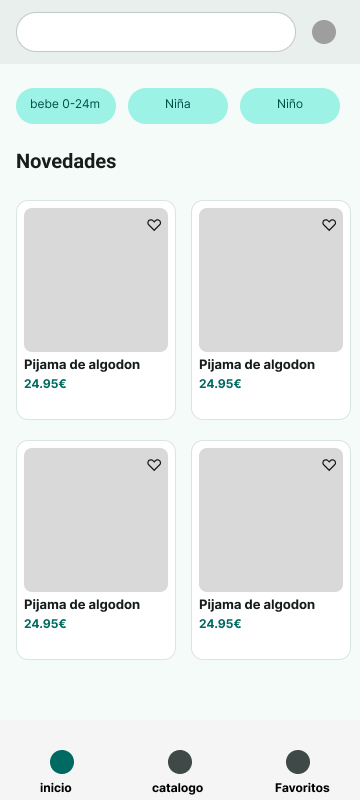
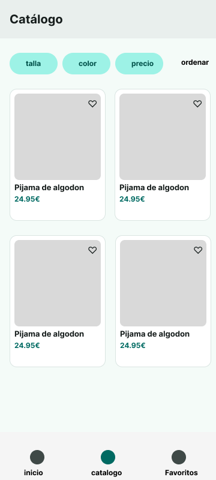
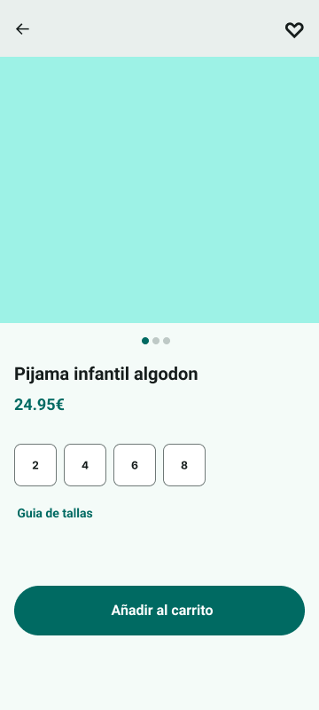
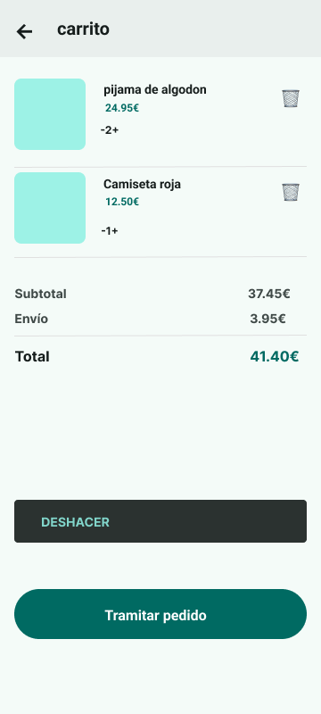
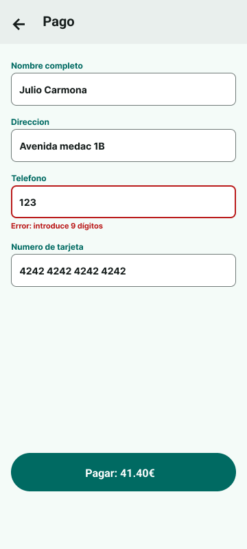

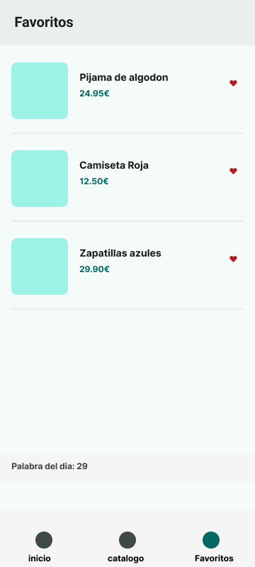

## 4. Validación y pruebas
### 4.1 Metodología

Se realizaron pruebas de usabilidad con 2 participantes externos al equipo, sin conocimiento previo del prototipo. Cada participante realizó 3 tareas sobre el prototipo navegable, midiendo:

- **Éxito:** ¿completó la tarea sin ayuda?
- **Tiempo:** duración en completarla.
- **Errores:** número de pasos erróneos, dudas o bloqueos.

**Tareas:**

1. Compra un pijama talla 4 años.
2. Encuentra la guía de tallas y dime qué talla equivale a 4 años.
3. Elimina un producto del carrito y luego recupéralo.
### 4.2 Resultados

| Participante | Tarea | Éxito | Tiempo | Errores |
|---|---|---|---|---|
| Participante 1 | Compra pijama talla 4 | ✅ | 1:42 | 0 |
| Participante 1 | Encontrar guía de tallas | ✅ | 0:14 | 0 |
| Participante 1 | Eliminar y recuperar | ✅ | 0:22 | 1 (no vio el snackbar al principio) |
| Participante 2 | Compra pijama talla 4 | ✅ | 2:05 | 1 (dudó en la talla) |
| Participante 2 | Encontrar guía de tallas | ✅ | 0:28 | 1 (buscó en la top bar antes del detalle) |
| Participante 2 | Eliminar y recuperar | ❌ | 0:35 | 2 (no encontró "Deshacer") |

**Tres hallazgos principales:**

1. **El snackbar "Deshacer" pasa desapercibido.** 1 de 2 participantes no lo vio a tiempo. La duración por defecto (corta) y la falta de un icono llamativo lo hacen poco visible.
   → **Decisión:** aumentar la duración del snackbar y añadir un icono de deshacer.

2. **La guía de tallas no se encuentra a la primera.** El participante 2 la buscó en la top bar antes de encontrarla en el detalle. Está demasiado sutil (texto sin fondo).
   → **Decisión:** convertir "Guía de tallas" en un botón/chip con fondo turquesa claro y icono destacado.

3. **La selección de talla genera dudas.** Los participantes dudaron al elegir entre tallas por edad (2, 4, 6, 8) porque no saben a qué medidas equivalen

   → **Decisión:** ya cubierta por la mejora 2 (guía de tallas más visible).

### 4.3 Iteraciones y mejoras
Se aplicó una mejora basada en los hallazgos de la sección 4.2.

**Antes:**

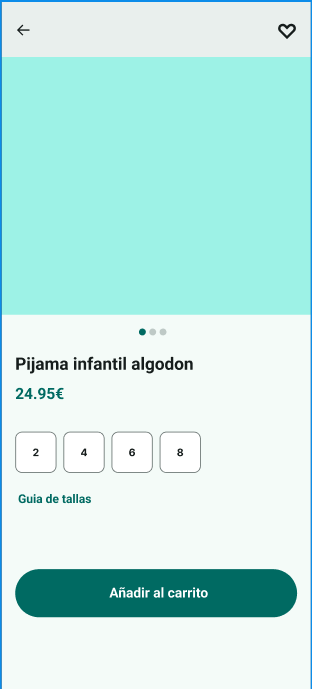

**Después:**

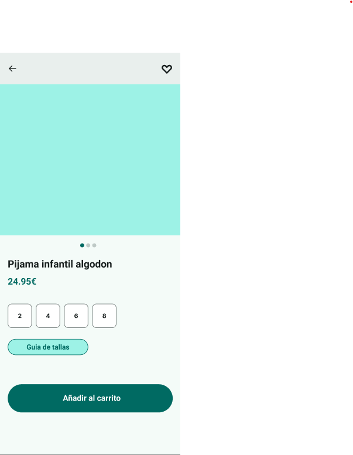

**Cambio aplicado:** el botón "Guía de tallas" pasa de ser un texto suelto a un chip con fondo turquesa claro (`#9DF2E6`), borde `#006A62` y texto en `#005049`. Motivo: 1 de 2 participantes no lo encontró a la primera. La nueva versión destaca visualmente y se reconoce como acción pulsable.

**Otras mejoras identificadas (no aplicadas por falta de tiempo):**

- Aumentar la duración del snackbar "Deshacer" a 5 s y añadir icono.
- Mostrar mensaje de confirmación visual al añadir al carrito.
## 5. Entrega y documentación final
### 5.1 Justificación del diseño propuesto
### 5.1 Justificación del diseño propuesto

El diseño de la app BABYTOOL se ha construido siguiendo los principios del diseño centrado en el usuario y la guía Material Design 3. Cada decisión está respaldada por los insights de la sección 2.4.

**Decisiones clave:**

- **Categorización por edad en la pantalla de inicio.** Los usuarios buscan ropa por edad del niño, no por tipo de prenda. Los chips "Bebé 0-24m", "Niña", "Niño" reducen la fricción inicial y aceleran la navegación.

- **Guía de tallas como bottom sheet.** Los usuarios dudan con las equivalencias entre edad y talla. Un bottom sheet en la pantalla de detalle, con una tabla clara, permite consultarla sin abandonar el flujo de compra.

- **Selector de talla propio con estados.** El componente `SelectorTalla` distingue entre tallas disponibles, seleccionadas y sin stock, evitando clics en vano y comunicando disponibilidad de un vistazo.

- **Snackbar "Deshacer" en el carrito.** El miedo a eliminar un producto por error se mitiga con un mensaje emergente que permite revertir la acción durante unos segundos.

- **Formulario de checkout con validación en tiempo real.** El campo Teléfono en estado de error (con mensaje de ayuda) demuestra el patrón M3 y reduce errores antes de enviar el formulario.

- **Zona del pulgar.** Las acciones críticas (añadir al carrito, pagar, tramitar pedido) están situadas en la mitad inferior de la pantalla, alcanzables con el pulgar en uso a una mano.

- **Accesibilidad.** Todos los textos superan contraste 4,5:1, las áreas táctiles son de al menos 48×48 dp, y la tipografía base es de 16 sp.

**Valor diferencial:** BABYTOOL no es solo un catálogo. Es una herramienta pensada para reducir la duda de talla (el principal motivo de devolución en moda infantil) y para que tanto madres con poco tiempo como abuelos con poca destreza digital puedan comprar en menos de 2 minutos.
### 5.2 Recomendaciones y pasos a seguir
### 5.2 Recomendaciones y pasos a seguir

El prototipo entregado es una primera versión funcional, orientada a validar el flujo de compra y las decisiones de diseño principales. Para llegar a producción se recomienda:

1. **Pruebas con usuarios reales a mayor escala.** Ampliar el estudio de usabilidad a 10-15 participantes por segmento (madres/padres, abuelos, regaladores) y medir métricas reales como tasa de conversión, tiempo por tarea y abandonos.

2. **Ampliar el catálogo y el backend.** Conectar la app a un sistema real de gestión de productos, con fotos de calidad y filtros funcionales por edad, talla, color y precio.

3. **Modo oscuro completo.** Extender el esquema oscuro a todas las pantallas (ahora solo Inicio y Detalle), manteniendo el contraste verificado.

4. **Notificaciones y fidelización.** Añadir notificaciones push de ofertas y recordatorios de carrito abandonado. Incorporar un sistema de puntos o descuentos para clientes recurrentes.

5. **Métodos de pago alternativos.** Añadir opciones como Bizum, PayPal o pago a plazos, comunes en el mercado español.

6. **Accesibilidad avanzada.** Auditar con TalkBack (lector de pantalla de Android) y ajustar etiquetas semánticas de los componentes.

7. **Internacionalización.** Preparar los textos para traducirlos al catalán, gallego, euskera e inglés, dado que BABYTOOL puede operar en varias comunidades autónomas.
## 6. Referencias bibliográficas

Google. (2024). *Material Design 3*. https://m3.material.io/

Nielsen, J. (2020). *10 usability heuristics for user interface design*. Nielsen Norman Group. https://www.nngroup.com/articles/ten-usability-heuristics/

Norman, D. A. (2013). *The design of everyday things: Revised and expanded edition*. Basic Books.

W3C. (2023). *Web Content Accessibility Guidelines (WCAG) 2.2*. World Wide Web Consortium. https://www.w3.org/TR/WCAG22/

Zimmerman, J., & Forlizzi, J. (2014). *Research through design in HCI*. In J. S. Olson & W. A. Kellogg (Eds.), *Ways of knowing in HCI* (pp. 167-189). Springer.

Palabra del día: 29